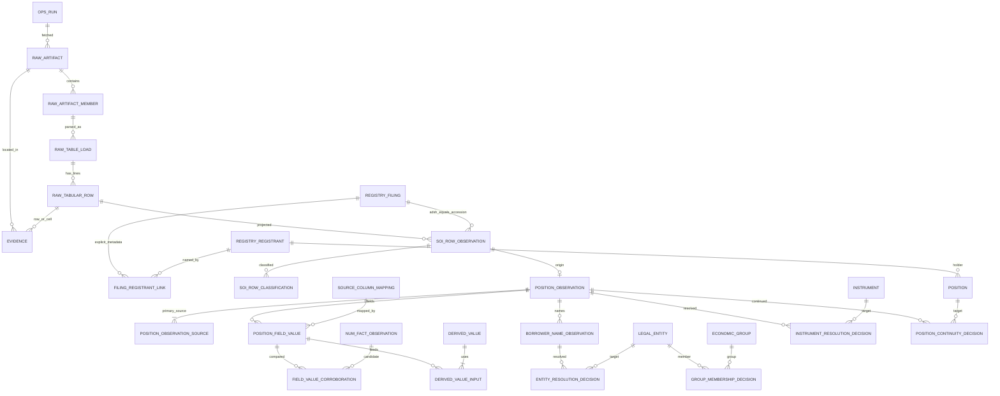

# Data model

**Status:** Phase 3 schema and SOI ingestion, plus golden-slice P4-min borrower-name
projection, P5-min filing-document checks, P6-min legal-entity resolution, P7-min
instrument identity plus per-registrant continuity, the Phase 8 Golden Borrower Gate
(validation of that slice), and P9-min registrant-first-observed events. These slices do not rewrite SOI rows or scan the SOI universe.
The BDC master registry, filing history, and
raw Schedule of Investments (SOI) rows can be loaded from verified SEC sources into a local
database. Universe-wide entity/instrument resolution, authoritative cost/fair value, and
workspaces other than Borrowers are not in this phase. The schema is
defined by the migrations in `db/migrations/` (PostgreSQL 17) and checked by
`npm run db:test`. `db/schema.snapshot.sql` is the reviewed, normalized schema dump.

Decisions: [ADR 0009](adr/0009-postgresql-and-plain-sql-migrations.md) (database and
migrations), [ADR 0010](adr/0010-observation-provenance-and-authority-model.md) (observation,
provenance, and authority model), [ADR 0011](adr/0011-registry-ingestion.md) (registry
ingestion), and [ADR 0012](adr/0012-soi-ingestion.md) (SOI ingestion). Source facts:
[SOURCE_SCHEMAS.md](SOURCE_SCHEMAS.md).

## 1. Principles enforced by the schema

| Principle | Mechanism |
| --- | --- |
| SOI has no natural key | Raw rows are identified by location (table load + line number). No unique constraint in `obs` uses business columns. Duplicate rows become separate observations. |
| Raw before normalized | `raw.tabular_row` keeps the exact line, its SHA-256, and cells that must equal the tab split of the line. Typed observations keep the raw text next to the normalized value. |
| Append-only history (G-10) | Every table has triggers that reject UPDATE, DELETE, and TRUNCATE (SQLSTATE `BDCA1`). Application roles have INSERT and SELECT only. Corrections supersede. |
| Provenance (G-12) | Every material row has NOT NULL `evidence_id`, `run_id`, and a rule version. Evidence points into a checksummed artifact. |
| Registrant identity (G-09) | CIK exists only in `registry.registrant`. A filing's registrant comes only from `registry.filing_registrant_link` with source SUB, submissions JSON, or filing header. There is no accession-prefix column or option. |
| Unknown is valid (G-04) | `UNKNOWN` and `NOT_APPLICABLE` are value states. Unknown values cannot carry a normalized value. A normalized zero requires disclosed zero text. No value column has a default. |
| Missing coverage is not zero (G-05) | Coverage is asserted per aspect (`FILING_METADATA`, `FILING_HISTORY`, `SOI_HOLDINGS`) in `ops.coverage_assertion`. A scope without an assertion has UNKNOWN coverage. Only `COVERED` counts as covered. Empty SOI periods are `EMPTY_PERIOD`, never zero holdings. |
| Resolution states (G-13) | Decisions use exactly `MATCHED`, `PROBABLE`, `UNRESOLVED`, `REJECTED`. Only `UNRESOLVED` may have no target. |
| Separate identities (G-14, G-15) | Legal entity, economic group, instrument, and position each have their own decision table. Identity rows hold identifiers only. |
| Deterministic derivation (G-07) | Derived values record the metric rule version and their exact inputs. A database gate blocks provisional inputs and Unknown-to-number conversions. |
| No LLM authority (G-08) | Decision actors are `SYSTEM_RULE` or `HUMAN_REVIEW` only. |

## 2. Layers

| Schema | Holds |
| --- | --- |
| `ops` | Runs and outcomes, rule versions and activations, audit events, coverage assertions, artifact-processing ledger, projection exceptions, migration ledger |
| `raw` | Artifacts (downloaded bytes), artifact lineage, ZIP members, table loads, raw rows, JSON documents and flattened JSON values |
| `registry` | Registrants, registrant attribute and name-history observations, data-set releases and listings, BDC Report editions, filings, registrant links, filing attributes, filing documents, amendment decisions |
| `evidence` | Evidence locators and supplementary (corroborating or contradicting) evidence |
| `obs` | SOI row observations and classifications, NUM facts, position observations and sources, groups, field values, corroborations, borrower-name observations, cross-artifact equivalence |
| `identity` | Legal entities and aliases, economic groups, instruments and attribute assertions, positions |
| `resolution` | Match candidates with per-attribute comparisons (no scores) and the four decision tables |
| `validation` | Validation results and evidence-status assertions |
| `derived` | Derived values, their inputs, and P9-min observation events |
| `ref` | Enums, reference vocabularies, and versioned source-column mappings |

## 3. Lineage (entity-relationship overview)

Every observation, field value, and decision also references `ops.run`, `ops.rule_version`,
and `evidence.evidence` (omitted from the diagram for readability).

## 4. Position observations and field values

- **Grain:** one `obs.position_observation` per SOI row with a non-empty identifier, per builder
  rule version. Rows are never merged. Duplicates, lots, and comparative rows can be grouped in
  `obs.position_observation_group` with a resolution state; the observations stay intact.
- **Dates:** the reported date is month-end rounded by the source (`date_precision =
  MONTH_END_ROUNDED`). `qtrs` determines `duration_kind` (0 = point in time). Whether a row is
  the current period is a rule-versioned classification that may be `UNRESOLVED` (Q6, Q15).
- **Field values** (`obs.position_field_value`): one row per field, with source column label and
  position, raw text, at most one normalized value typed by the field definition, currency and
  currency state, scale state, value state, reasons for Unknown or Not applicable, the
  normalization rule version, and evidence. The trigger checks that the raw text equals the
  source cell and that the mapping matches the column and field.
- **Absent fields:** `obs.position_field_status` lists every field for every position
  observation and shows `UNKNOWN` where no value row exists.

## 5. Authority (computed, never stored)

`obs.field_value_authority` classifies each current field value, first match wins:

| Order | Condition | Authority |
| --- | --- | --- |
| 1 | value state `UNKNOWN` / `NOT_APPLICABLE` | `UNKNOWN` / `NOT_APPLICABLE` |
| 2 | current column mapping `REJECTED` | `UNRESOLVED` |
| 3 | field requires Level 2 evidence and has neither Level 2 evidence nor `FILING_VERIFIED` | `UNKNOWN` |
| 4 | evidence status `FILING_MISMATCH` | `UNRESOLVED` |
| 5 | current mapping `OPEN_QUESTION` or `OBSERVED_UNCONFIRMED` | `PROVISIONAL` |
| 6 | currency taken from a unique NUM match (an undocumented join) | `PROVISIONAL` |
| 7 | scale `UNRESOLVED` (Q4) | `UNRESOLVED` |
| 8 | `FILING_VERIFIED`, or Level 2 evidence | `AUTHORITATIVE` |
| 9 | otherwise (documented data-set column, not yet filing-verified) | `REPORTED_STRUCTURED` |

Derived values carry `DERIVED` in `derived.derived_value.result_state`.

## 6. Source-column mappings and the derivation gate

`ref.source_column_mapping` records, per source column label, the target field, the basis
(documented preset, other documentation, observed value agreement, observed label), and the
status. It was seeded from `SOURCE_SCHEMAS.md`:

- the documented SOI preset columns (`DOCUMENTED_AND_OBSERVED`; the empty preset cost and fair
  value columns `DOCUMENTED`);
- **"Adjusted cost basis" and "Initial fair value of Investment": `OPEN_QUESTION` (Q14)**;
- other dynamic columns named in the availability matrix: `OBSERVED_UNCONFIRMED`;
- `cstm`: raw only, `OPEN_QUESTION` (Q19).

`derived.derived_value_input` rejects (SQLSTATE `BDCD1`) any field value whose *current* mapping
is not `DOCUMENTED` or `DOCUMENTED_AND_OBSERVED`, any superseded field value, and any Unknown
input to a `DERIVED` result. A mapping changes only by a new superseding row (by migration or
review; the pipeline writer role cannot write mappings).

## 7. History and "current"

- Single-chain tables (decisions, classifications, mappings, field values, evidence status,
  coverage): the first row for a subject is the root; every later row must supersede the
  current head with a reason (SQLSTATE `BDCS1` otherwise); a row can be superseded once, so the
  head is unique. `current_*` views return the head.
- Multi tables (registrant links, registrant and filing attributes, aliases, instrument
  attributes, groups): several independent rows per subject may be current at once; views
  return all of them. `registry.current_filing_registrant` reports `LINKED`, `MULTIPLE`, or
  `UNKNOWN` instead of choosing.
- SEC refreshes: a new checksum at the same URL is a new `raw.artifact` linked by
  `raw.artifact_lineage`; unchanged rows can be linked by `obs.observation_equivalence`.
- Amendments: both filings and all observations are kept. Phase 2 records an `UNRESOLVED`
  `AMENDS` decision with no target (`NO_AMENDMENT_MATCHING`); `PREVRPT` is raw only (Q17).
- Cross-source disagreements (form, filed date, registrant CIK) remain as separate values
  plus a `FAIL` validation result and `CONTRADICTS` supplementary evidence. Nothing picks
  a winner.
- `ref.registry_field_mapping` records each loaded source field and whether it is
  documented or only observed. Observed is not authoritative.

## 8. Vocabularies

Guardrail-fixed sets are PostgreSQL enums in `ref` (`resolution_state`, `value_state`,
`mapping_status`, `evidence_level`, `evidence_status`, `coverage_state`, `parse_status`,
`period_role`, `duration_kind`, `currency_state`, `scale_state`, `validation_outcome`,
`actor_kind`, `filing_link_source`, and others). Extensible sets are reference tables
(`ref.source_type`, `ref.dataset_table`, `ref.field_definition`, `ref.registrant_attribute`,
`ref.filing_attribute`).

A decision's confidence classification is its resolution state. No separate data-confidence
column is stored; value state, evidence status, and computed authority cover it (see
`METHODOLOGY.md`).

## 9. Roles

| Role | Privileges |
| --- | --- |
| migration owner | Owns every object; applies migrations; writes reference mappings and rule activations |
| `bdc_pipeline_writer` | SELECT and INSERT on history tables; SELECT on reference tables and views; no UPDATE, DELETE, or TRUNCATE anywhere |
| `bdc_reader` | SELECT on views only |

No web role exists yet.

## 10. Error codes

| SQLSTATE | Meaning |
| --- | --- |
| `BDCA1` | Append-only violation |
| `BDCS1` | Invalid supersession |
| `BDCL1` | Missing required link (source, member, or input), checked at commit |
| `BDCD1` | Derivation gate violation |
| `BDCI1` | Cross-row integrity violation (for example raw text not matching its source cell) |

## 11. Not in this phase

NUM and other ZIP tables beyond SUB metadata and SOI, universe-wide entity/instrument/position
resolution, authoritative cost and fair-value normalization (Q14 remains OPEN QUESTION),
analytics, and workspaces other than Borrowers. Amendment matching is not
performed. Currency via the undocumented SOI-to-NUM join is not applied. P5-min lands
Golden filing-document bytes and records exact-string `DOCUMENT` checks; it does not
parse iXBRL facts or change Q14 mapping status. P6-min creates one Golden legal entity
from exact normalized names; near-name candidates stay UNRESOLVED. P7-min MATCHED instruments
require a disclosed Investment Type Axis member and keep per-registrant continuity series
separate; unknown type stays UNRESOLVED. Economic groups remain unused. Q14 cost/fair value
stay OPEN_QUESTION. The Phase 8 Golden Gate evaluates this slice and records
`derived.golden_observation_count` v1 on the gate run; it does not insert COST/FV into
`derived.derived_value`, does not MATCH instruments from missing type attributes, and does
not start Phase 10 UI. P9-min stores `derived.observation_event` rows only for
`REGISTRANT_FIRST_OBSERVED_NAME`. That event copies the observation date and evidence.
It does not create an instrument, an amount, a coverage-gap exit, or a Q14 valuation.
Other event types stay blocked. Phase 10-min reads `registry.borrower_observation_listing`
for the Borrowers, Borrower Intelligence, and Sources pages. That view has no cost,
fair value, or instrument identity column. Refinancing, portfolio, market, authentication,
watchlists, and export are not started.
